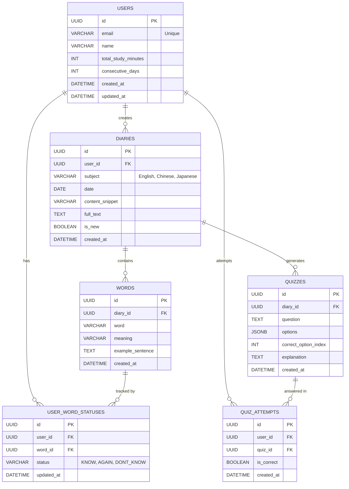

# Zzamzzami ERD (Entity Relationship Diagram) 명세서

본 문서는 `API_SPEC.md`, `functions.md`를 기반으로 FastAPI + SQLAlchemy(또는 SQLModel) 백엔드 데이터베이스 구조를 정의합니다.

## ERD 다이어그램 (Mermaid)

## 테이블 명세 (SQLAlchemy / SQLModel 기준)

### 1. 사용자 (`users`)
사용자 계정 및 누적 학습 기록을 관리하는 테이블입니다. (`GET /dashboard` 대시보드 통계 계산 시 참조)

| 컬럼명 | 타입 | Nullable | 설명 |
|---|---|---|---|
| id | UUID | N | 사용자 고유 식별자 (PK) |
| email | VARCHAR | N | 이메일 주소 (Unique) |
| name | VARCHAR | N | 사용자 이름/닉네임 |
| total_study_minutes | INT | N | 누적 학습 시간 (분 단위, 기본값 0) |
| consecutive_days | INT | N | 연속 학습일수 (기본값 0) |
| created_at | DATETIME | N | 계정 생성 일시 |
| updated_at | DATETIME | N | 계정 정보 수정 일시 |

### 2. 다이어리 (`diaries`)
카메라로 교재를 스캔(`POST /scan`)하여 추출된 텍스트 원본 및 메타데이터를 저장합니다. 홈 뷰(`GET /diaries`)에 나열됩니다.

| 컬럼명 | 타입 | Nullable | 설명 |
|---|---|---|---|
| id | UUID | N | 다이어리 고유 식별자 (PK) |
| user_id | UUID | N | 스캔한 사용자 식별자 (FK -> `users.id`) |
| subject | VARCHAR | N | 언어 과목 (`English`, `Chinese`, `Japanese` 등) |
| date | DATE | N | 스캔된 날짜 (홈 탭의 날짜별 정렬용) |
| content_snippet | VARCHAR | Y | 전체 텍스트 요약본 (홈 뷰 카드 미리보기용) |
| full_text | TEXT | N | OCR로 추출된 전체 원문 텍스트 |
| is_new | BOOLEAN | N | 새롭게 추가된 항목 여부 (기본값 TRUE) |
| created_at | DATETIME | N | 데이터 생성 일시 |

### 3. 단어 (`words`)
다이어리의 스캔 텍스트에서 AI로 추출한 주요 단어를 저장합니다. 릴스형 단어 복습 피드(`GET /words/review`)에서 조회됩니다.

| 컬럼명 | 타입 | Nullable | 설명 |
|---|---|---|---|
| id | UUID | N | 단어 고유 식별자 (PK) |
| diary_id | UUID | N | 추출된 대상 다이어리 (FK -> `diaries.id`) |
| word | VARCHAR | N | 추출된 단어 |
| meaning | VARCHAR | N | 단어의 뜻 |
| example_sentence | TEXT | Y | 단어가 활용된 예문 (원문 기반) |
| created_at | DATETIME | N | 생성 일시 |

### 4. 사용자-단어 학습 상태 (`user_word_statuses`)
특정 단어에 대한 사용자의 인지 상태를 기록합니다. 릴스 복습(`POST /words/status`) 로직에 의해 업데이트됩니다.

| 컬럼명 | 타입 | Nullable | 설명 |
|---|---|---|---|
| id | UUID | N | 레코드 고유 식별자 (PK) |
| user_id | UUID | N | 대상 사용자 (FK -> `users.id`) |
| word_id | UUID | N | 대상 단어 (FK -> `words.id`) |
| status | VARCHAR | N | 인지 상태 Enum (`KNOW`, `AGAIN`, `DONT_KNOW`) |
| updated_at | DATETIME | N | 상태가 마지막으로 업데이트된 일시 |

> **Note**: `user_id`와 `word_id` 조합은 데이터베이스 상에서 복합 고유 제약조건(Unique Constraint)을 가집니다.

### 5. 퀴즈 (`quizzes`)
스캔한 내용을 바탕으로 AI가 생성한 스토리형 변형 퀴즈 데이터를 저장합니다. (`GET /quizzes`)

| 컬럼명 | 타입 | Nullable | 설명 |
|---|---|---|---|
| id | UUID | N | 퀴즈 고유 식별자 (PK) |
| diary_id | UUID | N | 이 퀴즈가 기반을 둔 다이어리 (FK -> `diaries.id`) |
| question | TEXT | N | AI가 생성한 퀴즈 문제 (예: 빈칸 채우기 등) |
| options | JSONB | N | 선택지 배열 정보 (PostgreSQL JSONB 타입 활용) |
| correct_option_index | INT | N | `options` 배열 내 정답에 해당하는 인덱스 번호 |
| explanation | TEXT | N | 정답에 대한 상세 해설 및 인사이트 |
| created_at | DATETIME | N | 생성 일시 |

### 6. 사용자 퀴즈 이력 (`quiz_attempts`)
사용자가 스토리형 퀴즈를 풀었을 때의 결과 이력을 저장합니다. 대시보드(`GET /dashboard`)의 퀴즈 정답률을 계산하는 데 사용됩니다.

| 컬럼명 | 타입 | Nullable | 설명 |
|---|---|---|---|
| id | UUID | N | 퀴즈 풀이 이력 고유 식별자 (PK) |
| user_id | UUID | N | 퀴즈를 푼 사용자 (FK -> `users.id`) |
| quiz_id | UUID | N | 풀이 대상 퀴즈 (FK -> `quizzes.id`) |
| is_correct | BOOLEAN | N | 퀴즈 정답 여부 (TRUE/FALSE) |
| created_at | DATETIME | N | 퀴즈 풀이 제출 일시 |
